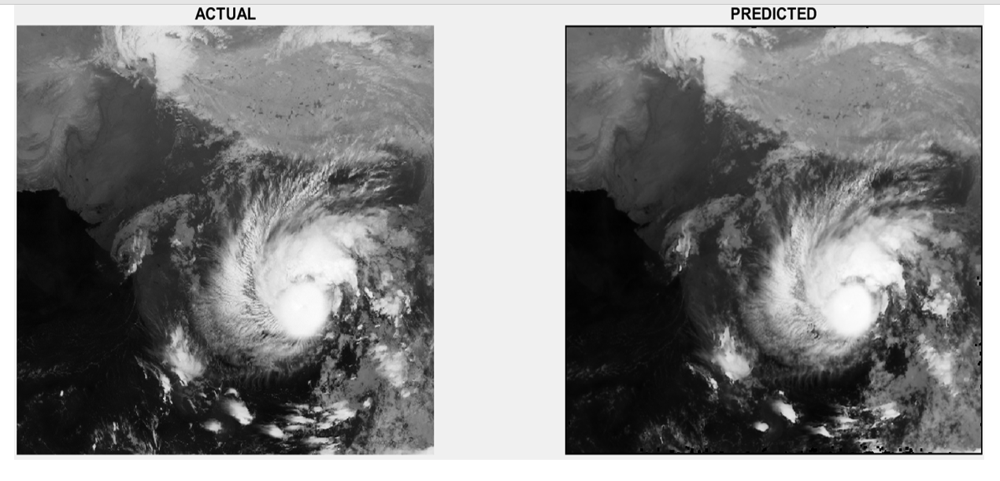
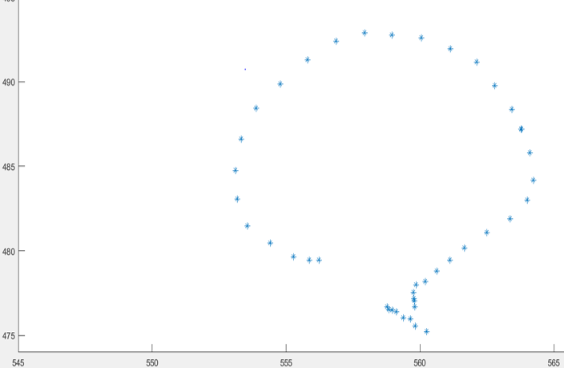

# OPTICAL FLOW METHODS

## Table of contents
 * [Software used](#Software-used )
 * [Optical Flow Methods Used](#Optical-Flow-Methods-Used)
 * [Output](#OUTPUT)

## Software used 
    MATLAB

## Optical Flow Methods Used-
 > Horn–Schunck
 
 > Lucas–Kanade
 
 Run LK.m file.
 
## OUTPUT-
 The program will produce next frame of image sequence and MSE between predicted and actual image.
 

 
 
 It also produces the flow vectors pictorially during image sequence movements.
 
 Calculates the net movement direction of cloud center of gravity and plots it graphically.
 
 
 
 Output files for the dataset provided by isro are saved in this folder.
